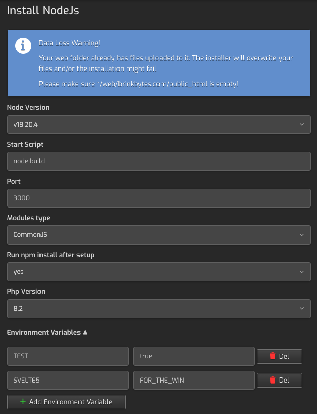

# HestiaCPv2 - add multiple NodeJS apps using QuickApp Installer.

This project is a fork of 'hestiacp-nodejs' by JLFdzDev
Original project: https://github.com/JLFdzDev/hestiacp-nodejs

Copyright (C) [2023] JLFdzDev
Copyright (C) [2024] [Trustos]

This program is free software: you can redistribute it and/or modify
it under the terms of the GNU General Public License as published by
the Free Software Foundation, either version 3 of the License, or
(at your option) any later version.

This program is distributed in the hope that it will be useful,
but WITHOUT ANY WARRANTY; without even the implied warranty of
MERCHANTABILITY or FITNESS FOR A PARTICULAR PURPOSE.  See the
GNU General Public License for more details.

You should have received a copy of the GNU General Public License
along with this program.  If not, see <https://www.gnu.org/licenses/>.

Significant changes from the original project:
- Removed option to select Node version, now exclusively supporting NVM
- Automatically installs NVM for the user if it's not installed
- Added automatic startup for PM2 on boot
- Added option to install dependencies after setup
- Added option to select module type (ES Modules or CommonJS)
- Added option to add environment variables
- Automatically fills in all the options if pre-existing configurations are found

## Description

You can add multiple websites to your HestiaCP using different ports for each one.

When you create the app with the installer it automatically creates:
* **/home/%USER%/%DOMAIN%/private/nodeapp** directory
* Config for **nginx** to use the selected port
* **ecosystem.config.js or ecosystem.config.cjs** with the necessary command to connect **pm2** and run your app Ex. `npm run start`
* **.nvmrc** file with node version (NVM is required)
* It will try to install NVM for the given user if it's not installed
* It will try to install the selected node version if it's not installed
* It will start the pm2 process and save it to start on boot (pm2 startup)
* It will try to run `npm install` or `npm ci` (when a package-lock.json exists) if you selected that option

## Requirements
1. Install [PM2](https://pm2.keymetrics.io/) globally (recommended)
  ```bash
  npm install pm2 -g
  ```

## Quick Install

```bash
wget -qO- https://raw.githubusercontent.com/trustos/hestiacp-nodejsv2/refs/heads/main/quickinstall-ubuntu.sh | sudo bash
```

## Manual Install

1. Install [NVM](https://github.com/nvm-sh/nvm#installing-and-updating)
2. Clone this repository:
	```bash
	cd ~/tmp
	git clone https://github.com/trustos/hestiacp-nodejs-v2.git
	cd hestiacp-nodejs-v2
	```

4. Use **install.sh**
	```bash
	sudo chmod 755 install.sh
	sudo ./install.sh
	```

5. 🚀 You are ready to install an App!!!

## How to use

1. Create new **user** (If you have one no need to create)
2. User needs bash access for app to work, go to **User edit** > **advanced options** > **SSH Access** > **bash**
3. **Add** new web (Ex. acme.com)
4. Go to **edit** this new web and go to **Quick Install App**
5. Select **NodeJS**
   * **Start Script**: It creates a `ecosystem.config.js` file in root of nodeapp with the script that you fill (it should be the one you have in your `package.json`) for PM2 to manage the app.

   * **Port**: You can manage multiple apps with different ports, put different port for each app you have (Ex. 3000).
   It creates `.env` file in root of nodeapp with the selected port, without overwriting existing variables.

   * **Modules type**: Choose between "ES Modules" or "CommonJS" based on your project's module system.

   * **Run npm install after setup**: Select "yes" if you want to automatically install dependencies after setup.

   * **PHP Version**: This is only for HestiaCP you can put any value (**NOT IMPORTANT**)

   * Environment Variables: You can add environment variables to your app. It creates `.env` file in root of nodeapp with the selected variables.
   **NB**: The variables will be overwritten with the values that are set in the form.
   **NB**: The variables are stored in plain text, so be careful with sensitive data.

6. Go to Edit web > Advanced Options > Proxy Template > NodeJS
7. Upload your app with filemanager, ftp or clone with git... in `/home/<user>/<domain.com>/private/nodeapp`
8. PM2 will automatically start your app and set up to run on system startup
9. 🎉 Congratulations you're done!!!

## FAQ

### I am getting an error about nvm not being able to install.

This happens if you have a global nvm installation and the script is trying to install nvm for the user.
You should make sure to remove the nvm for the root user and $NVM_DIR should not be in the $PATH var.


### Where to find the logs

Most of the actions performed by the script are logged in the Profile -> "Logs" section of the HestiaCP panel.
Also logs are written in the hestia's system and error logs.

### How to change the port if i have a web running

First change proxy template to default, reconfigure the app using the QuickInstall and finally change the proxy template to NodeJS.

### I want to remove the domain

Remove it normally, open the filemanager and remove hestiacp_nodejs_config/web/<domain.com>.

Example config for SvelteKit app:

